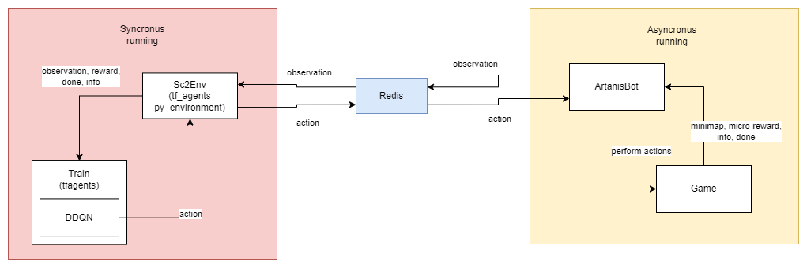

# SC2-RL

Creation of a **Reinforcement Learning** agent that plays **Starcraft II**. This project emerges from the interest on reinforcement learning and the complexity of a stratigic game like starcraft.

## Diagrams

This section will help you understand how the ecosystem works.

### Components diagram

Displays the components and the interactions between each other.

### Execitiom diagram

Since the execution of the exosystem has two different times, since half part is asyncronous and the other is synchronus, the diagram tries to reflect what is the workflow.

## Setup steps

- If you are using windows, you need to install [Microsoft C++ Build Tools](https://visualstudio.microsoft.com/visual-cpp-build-tools/), once it is installed, select `Desktop development with C++`. After installed, `gymnasium[box2d]` will work.

- If you are using WSL, follow this steps: [WSL Installation](https://github.com/BurnySc2/python-sc2/blob/develop/README.md#wsl)

1. [Starcraft II](https://starcraft2.blizzard.com/en-us/) installed in your system
2. [Python](https://www.python.org/downloads/) >= 3.7
3. Install dependencies `poetry install`
4. Add dependencies inside environment (`tensorflow` && `tf_agents`)
    1. `.venv/Script/Activate.ps1` (Windows)
    2. `source .venv/script/activate` (Linux/MacOS)
    3. `pip install tensorflow tf_agents`
5. Install dependecy [python-sc2](https://github.com/BurnySc2/python-sc2)
6. Create a folder named `logs` on parent folder
7. Create a folder named `Maps` under your `Starcraft II` installation folder.
8. Add maps (.SC2MAP files) under previous folder, they are available for download in sites such as [sc2mapster](https://www.sc2mapster.com/maps).
    1. For this use case, [scorpion](https://www.sc2mapster.com/projects/desert-map-melee-1v1) map is used.

In case you are having trouble with environment, once done step 4.3, repeat step 3.

### Run

1. Using [docker](https://docs.docker.com/engine/install/ubuntu/) run [redis](https://redis.io/docs/install/install-stack/docker/) service
    1. `docker run -d --name redis-stack-server -p 6379:6379 redis/redis-stack-server:latest`
2. Activate your environment and execute `python main.py`
    1. Linux `source .venv/scripts/activate`
    2. Windows `.venv/Scripts/Activate.ps1`

## Authors

- [w-dan](https://github.com/w-dan/)
- [blitty-codes](https://github.com/blitty-codes/)
- [Alvaro Tena](https://github.com/AlvaroTena)

Setup created following [setup tutorial](https://pythonprogramming.net/intro-python-sc2-introduction-starcraft-2-ai/) by [sendtex](https://www.youtube.com/@sentdex)  
